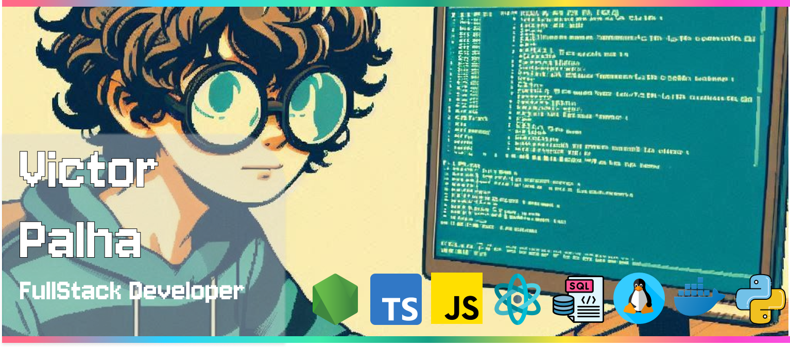

<!--  -->

  
  
   
  
  
  

 

## Technologies that I use in my everyday:

 

  

    
    
    
    
     
    
    
    
    
           
    
  

 

## Complementary technologies:

 
 

  
  
  
  
  

  

## 🧡 About me:

👋 Hello! My name is Victor Palha, and I am a FullStack Developer with a degree in Computer Science. I've gained valuable experience working in companies and now I’m currently freelancing.   
🧠 My journey in Web programming began in 2021, and since then, I’ve been driven by a passion for technology and innovation. My long-term goal is to grow professionally and eventually become a Senior Developer.  
🧑‍💻 I work mainly with Javascript/Typescript, React, TailwindCSS, NodeJS, Prisma, Fastify, and Express.  
🧑🏻 I believe in being respectful and polite, and I love engaging with new people. Let’s talk tech, games, or sports! Feel free to reach out.   
💻 Check out my [portfolio](https://victor-palha.com)!

 

<h2 align='center'>Contact me</h2>

