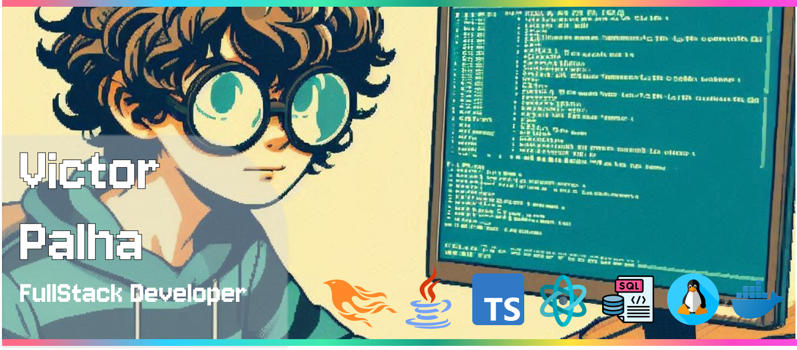

# Victor Palha | FullStack Developer



## **Tech Explorer & Code Alchemist**
Blending creativity with logic to craft digital experiences that matter. Passionate about functional programming, performance optimization, and clean architecture.

<div align="center">
  
  
  
  
  
</div>


## 🔮 **My Tech Grimoire**

### **Daily Spells (Core Stack)**
<div style="display: flex; flex-wrap: wrap; gap: 15px; justify-content: center;">
<!-- Elixir Ecosystem -->


<!-- Java Ecosystem -->


<!-- JS/TS Ecosystem -->


</div>

### **Supporting Tools**
<div style="display: flex; flex-wrap: wrap; gap: 15px; justify-content: center;">
  
  
  
  
  
  
</div>

<br/>

## **Dev Character sheet**
```elixir
%Developer{
  name: "Victor Palha",
  title: "FullStack Sorcerer",
  education: ["BSc in Computer Science", "MBA in Software Engineering"],
  current_quest: "Freelance Adventures",
  next_level: "Elixir Archmage",
  traits: [:curious, :sarcastic],
  hobbies: [:gaming, :writing, :open_source],
  superpower: "Transforming coffee into clean code"
}
```

I see programming as alchemy turning abstract ideas into tangible solutions. My journey began in 2021, and I've since:
- Worked with established companies
- Mastered the art of debugging ancient legacy code
- Developed a healthy obsession with Phoenix LiveView (kinda healthy...)
- Written [blog posts](https://victor-palha.github.io/) that mix tech insights with dry humor

**Philosophy:** *"Code should be like a good joke! efficient delivery, no unnecessary parts, and if you have to explain it, it's not good enough."*


## **Send a Raven (Contact)**
<div align='center' style="margin-top: 20px;">

[](https://www.linkedin.com/in/victor-palha/)
[](https://victor-palha.com)
[](mailto:hello@victor-palha.com)

</div>

